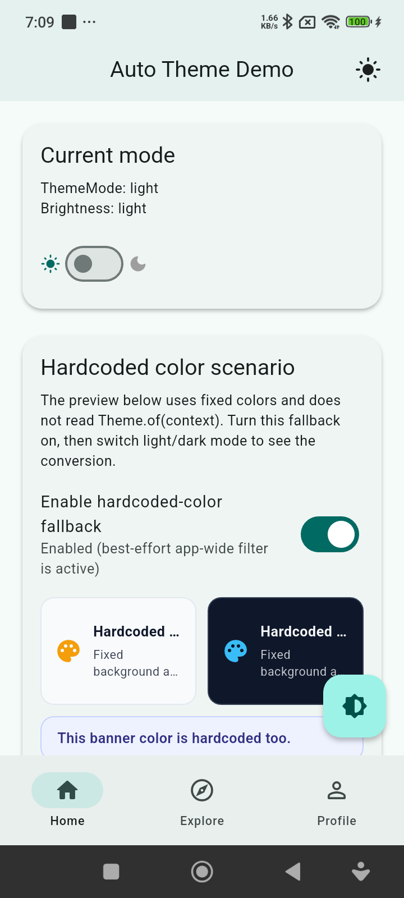
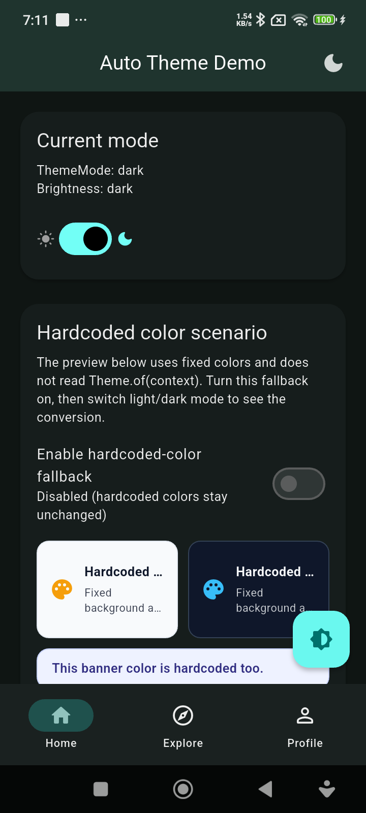
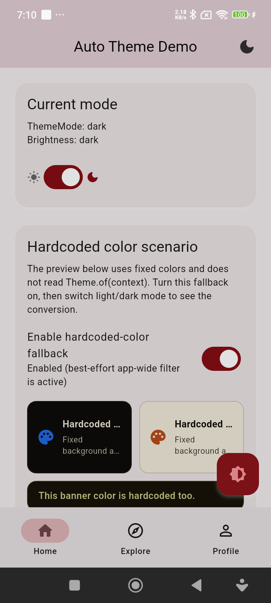

# auto_theme

`auto_theme` lets you design your Flutter app in one mode and automatically get
the opposite mode for free.

Build a light theme and it generates the dark theme.
Build a dark theme and it generates the light theme.

## Screenshots

| Light mode | Dark mode (fallback off) | Dark mode (fallback on) |
| --- | --- | --- |
|  |  |  |

## Why use it

- Start with a single `ThemeData`
- `theme` is optional (a default Material 3 theme is used if omitted)
- Get both `theme` and `darkTheme`
- Works with Material 3 and `ColorScheme`
- Includes runtime theme switching
- Ships with a simple `MaterialApp` wrapper
- Still lets you override the generated opposite theme when needed
- Includes an optional hardcoded-color fallback for non-themed widgets

## Best fit

`auto_theme` works best when your app already uses Flutter theming properly:

- `ThemeData`
- `ColorScheme`
- Material component themes like `AppBarTheme`, `CardTheme`, and `InputDecorationTheme`

If your widgets use lots of hardcoded colors, custom painting, or branded image
assets, you can enable a fallback color filter. It is best-effort and may also
affect images and brand assets.

## Installation

```yaml
dependencies:
  auto_theme: ^0.1.1
```

## Quick start

Wrap your app and provide only one theme:

```dart
import 'package:auto_theme/auto_theme.dart';
import 'package:flutter/material.dart';

void main() {
  runApp(const MyApp());
}

class MyApp extends StatelessWidget {
  const MyApp({super.key});

  @override
  Widget build(BuildContext context) {
    return AutoThemeApp.materialApp(
      theme: ThemeData(
        useMaterial3: true,
        colorScheme: ColorScheme.fromSeed(
          seedColor: Colors.indigo,
          brightness: Brightness.light,
        ),
      ),
      home: const HomePage(),
    );
  }
}
```

You can also omit `theme`:

```dart
AutoThemeApp.materialApp(
  home: const HomePage(),
)
```

That single `theme` becomes:

- `theme` when the source theme is light
- `darkTheme` when the source theme is dark
- an auto-generated opposite theme for the other side

## Builder usage

Use the builder constructor if you want full control over `MaterialApp`:

```dart
AutoThemeApp(
  theme: myDarkTheme,
  initialThemeMode: ThemeMode.dark,
  builder: (context, lightTheme, darkTheme, themeMode) {
    return MaterialApp(
      theme: lightTheme,
      darkTheme: darkTheme,
      themeMode: themeMode,
      home: const HomePage(),
    );
  },
);
```

## Generate only the opposite theme

If you don't want the wrapper widget, generate the missing theme directly:

```dart
final darkTheme = ThemeGenerator.generateOpposite(myLightTheme);
```

## Programmatic control

Access the controller anywhere below `AutoThemeApp`:

```dart
final controller = AutoThemeApp.of(context);

controller.toggle();
controller.setLight();
controller.setDark();
controller.setSystem();
```

## Ready-made toggle widgets

Use the included switch in an app bar:

```dart
AppBar(
  actions: const [
    AutoThemeSwitch(includeSystem: true),
  ],
)
```

Or use the switch-style toggle:

```dart
const AutoThemeToggle()
```

## Provide your own opposite theme

If the generated theme gets you 90% of the way there, you can still inject a
hand-tuned opposite theme:

```dart
AutoThemeApp.materialApp(
  theme: myLightTheme,
  oppositeTheme: myDarkTheme,
  home: const HomePage(),
)
```

## Hardcoded color fallback (experimental)

If your app has many hardcoded widget colors (`Container(color: ...)`,
`TextStyle(color: ...)`) you can enable a global fallback filter:

```dart
AutoThemeApp.materialApp(
  theme: myLightTheme, // optional
  hardcodedColorStrategy: HardcodedColorStrategy.colorFilter,
  hardcodedColorFilterStrength: 1.0, // 0.0 to 1.0
  home: const HomePage(),
)
```

How it behaves:

- When the active mode matches your source mode, no global filter is applied
- When the opposite mode is active, the fallback filter is applied app-wide
- It is best-effort and can also alter photos, logos, and other assets

## How it works

`auto_theme` doesn't do a naive RGB inversion. It retunes colors by role:

- Backgrounds become appropriate light or dark surfaces
- Accent colors keep their hue but shift to more usable lightness values
- Text colors are adjusted for readability
- Contrast is checked and corrected where possible
- Common Material theme sections are mapped into the generated theme

## Example app

A complete demo is included in [example/lib/main.dart](example/lib/main.dart).

Run it with:

```bash
cd example
flutter run -d macos
```
